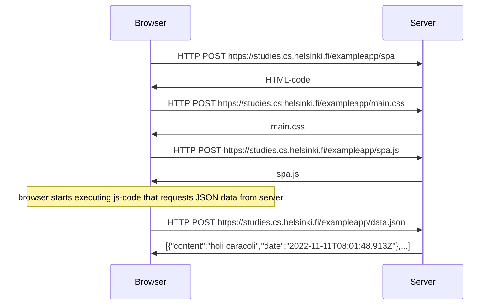

```mermaid
   sequenceDiagram
      participant Browser
      participant Server
      Browser->>Server: HTTP POST https://studies.cs.helsinki.fi/exampleapp/spa
      Server->>Browser: HTML-code
      Browser->>Server: HTTP POST https://studies.cs.helsinki.fi/exampleapp/main.css
      Server->>Browser: main.css
      Browser->>Server: HTTP POST https://studies.cs.helsinki.fi/exampleapp/spa.js
      Server->>Browser: spa.js
      note over Browser: browser starts executing js-code that requests JSON data from server
      Browser->>Server: HTTP POST https://studies.cs.helsinki.fi/exampleapp/data.json
      Server->>Browser: [{"content":"holi caracoli","date":"2022-11-11T08:01:48.913Z"},...]  

      
```

